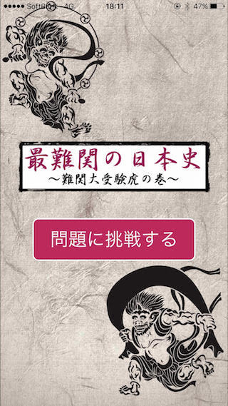
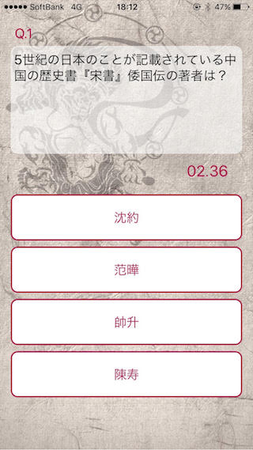
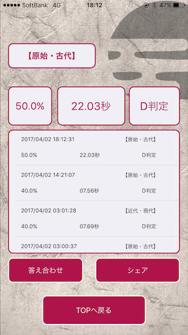

# 難関日本史クイズアプリ

## アプリの特徴
* 超難問が出題される日本史クイズアプリ（東大・早慶受験レベル）
* 正解率と回答時間から、S〜Eの判定結果を表示
* 過去８回分の学習の記録も閲覧可能
* 回答結果のSNSシェア機能も搭載

## スクリーンショット
  
  
  

## 実行環境
* プロジェクトをダウンロード
* Xcodeで実行！
* 対応：iOS 9.0以降 iPhone6、iPhone6s、iPhone7
